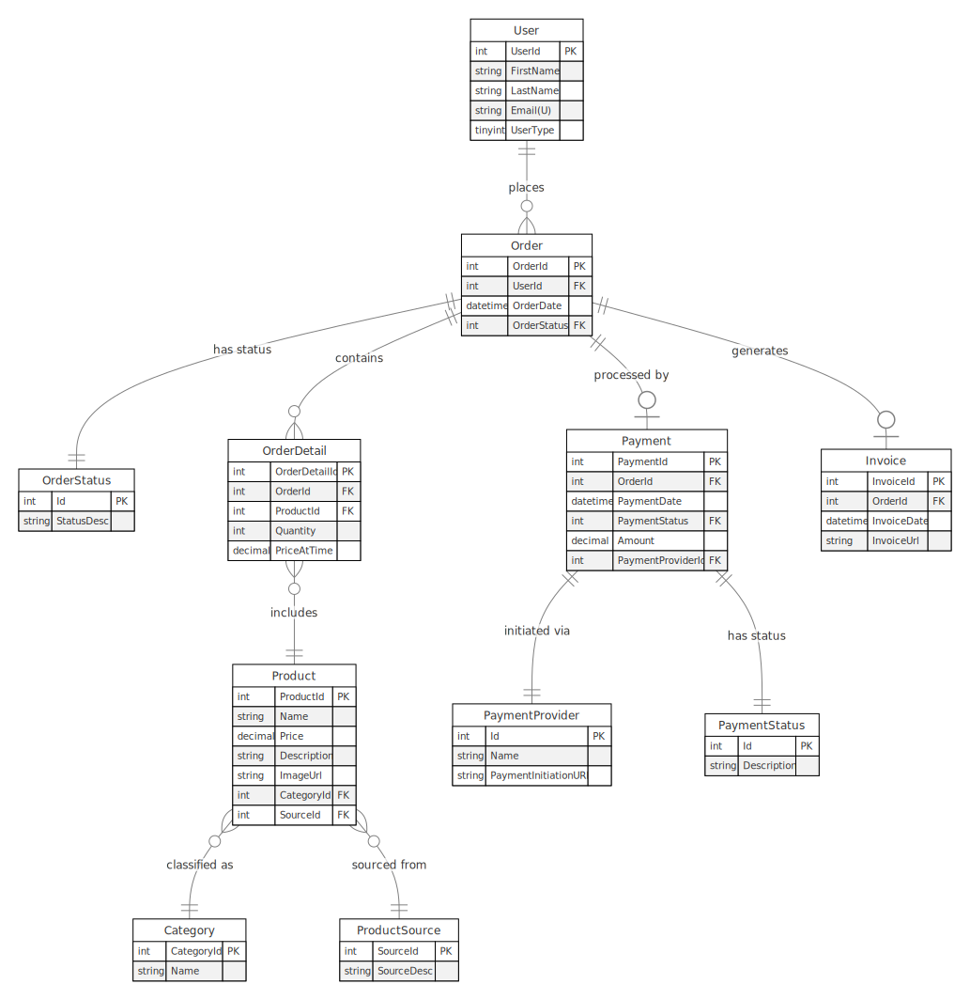

# Ordering System

**Task I: Architectural Diagram**

**Task II: E-R Diagram**

Assumptions:

1. This is the simplest possible design
2. Reviews on the Product entity are not tracked
3. PaymentProviders are not correctly setup. They should also have more info in order to handle payments

**Task III: Project**

